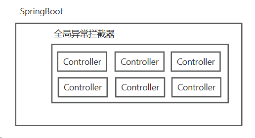
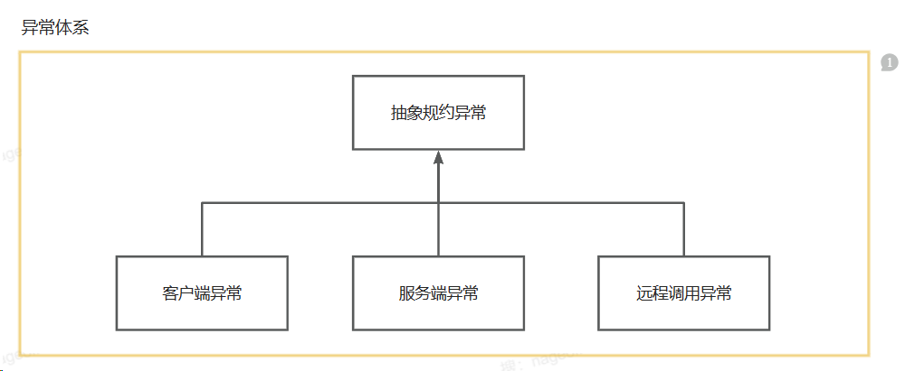
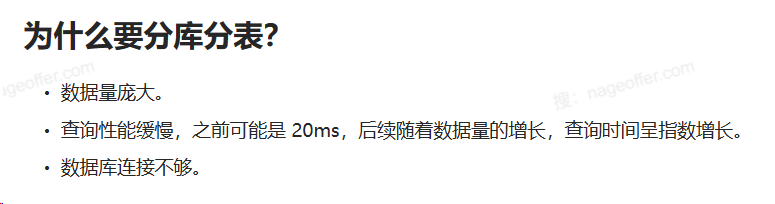
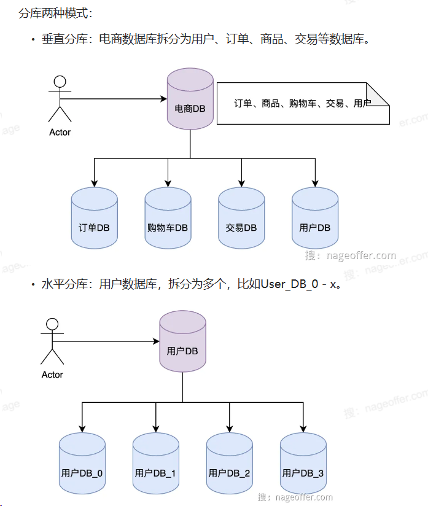
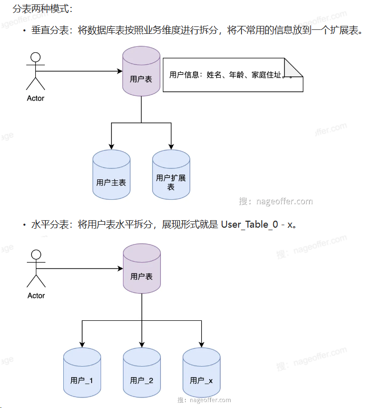
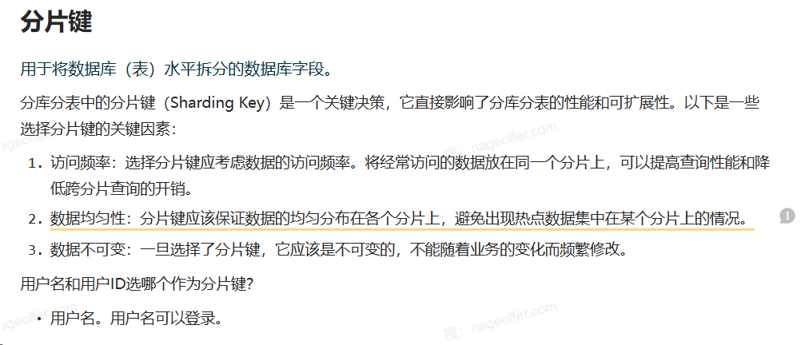

* remote.dto - 专门用作remote的
* dto - controller接收和请求数据都是需要一个载体的，用dto来接收请求参数和返回参数

#### User Module
* 检查用户名是否存在
* 注册用户
* 修改用户
* 根据用户名查询用户
* 用户登录
* 检查用户是否登录
* 用户退出登录
* 注销用户
#### 用户表设计

* code(不扩展HTTP的代码), message, data, success: true/false
* Lombok是一个Java库，用于自动化繁琐的Java开发任务，主要通过注解的方式来简化代码。Lombok提供了一系列的注解，通过这些注解可以自动生成构造器、getter/setter方法、toString方法等，从而减少了手写这些模板代码的需求。使用Lombok可以显著减少Java类的代码量，使代码看起来更加简洁，提高开发效率。  例如，如果你有一个Java类，通常你需要为这个类手动编写getter和setter方法。使用Lombok之后，你只需要在类上添加一个@Data注解，Lombok就会在编译时自动为你的类生成这些方法。此外，Lombok还支持注解如@NoArgsConstructor、@AllArgsConstructor和@Builder等，分别用于自动生成无参数构造函数、带有所有参数的构造函数和建造者模式。
* 错误码为字符串类型，共 5 位，分成两个部分：错误产生来源+四位数字编号。说明：错误产生来源分为 A/B/C。A 表示错误来源于用户，比如参数错误，用户安装版本过低，用户支付超时等问题；B 表示错误来源于当前系统，往往是业务逻辑出错，或程序健壮性差等问题；C 表示错误来源于第三方服务，比如 CDN 服务出错，消息投递超时等问题。四位数字编号从 0001 到 9999，大类之间的步长间距预留 100。
* 
* 
* 缓存穿透：将数据库已有的用户名全部放到缓存里。布隆过滤器是一种数据结构，用于快速判断一个元素是否存在于一个集合中。（Redisson)
* 分库/分表/分库分表
* 
* 
* 
* 